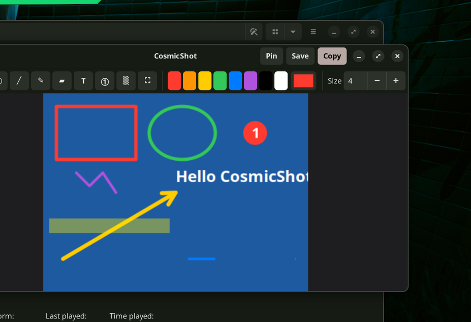

# CosmicShot

A **CleanShot X-style** screenshot + annotation tool for **Pop!_OS / COSMIC on Wayland**.

The stock COSMIC screenshot tool captures fine but can't annotate on the spot.
CosmicShot fills that gap: drag-select a region over a dimmed desktop, then land
straight in an editor to draw arrows, boxes, text, blur sensitive bits, add numbered
steps — and **copy, save, or pin** the result.



## Features

- **Dimmed region selector** — drag to select with a live `W × H` readout, crosshair,
  and resize handles. Multi-monitor aware. `Esc` cancels.
  - Each region capture starts with a **fresh crosshair**. `cosmicshot last` re-shoots
    the previous region instantly (no overlay) when you want a repeat.
- **Instant annotation editor** with tools:
  - **Direct manipulation with any tool** — you don't have to switch tools to edit an
    existing shape. Hover one (it highlights), then drag its **body to move** or a
    **handle to resize**; arrows/lines have endpoint handles, boxes have 8. Newly drawn
    shapes are auto-selected so you can tweak them right away. `Delete` removes the
    selected shape; changing the colour re-colours it. Outline boxes/ellipses are grabbed
    by their **border**, so you can still draw *inside* them. The **Select** tool (`V`) is
    a draw-nothing mode for when you only want to rearrange.
  - Arrow, Rectangle, Ellipse, Line
  - Freehand Pen, Highlighter (marker)
  - Text (inline, click-to-type)
  - **Blur / pixelate** for redacting sensitive info — adjustable strength
  - **Spotlight / focus** — darkens everything outside a resizable box, with an
    adjustable darkness level; great for drawing attention to one area
  - **Numbered step counters** (auto-incrementing)
  - **Crop** — drag, then **Apply crop** (or `Enter`); you stay in the editor on the
    cropped image and keep annotating. `Esc` cancels the pending crop.
  - Context-aware style control: **Thickness** for shapes, **Font size** for text,
    **Blur** strength, **Darkness** for spotlight — it swaps with the active tool and
    also re-styles the selected object.
- **Undo / redo** (full history, including crop, move, and resize).
- **Close confirmation** — closing with unsaved edits asks Save / Discard / Cancel.
- **Cloud upload** — one click uploads and copies a shareable URL to your clipboard
  (default host: catbox.moe — free, no account, permanent links). `Ctrl+U`.
- **Copy to clipboard**, **Save PNG**, or **Pin to screen** (floating, always-on-top;
  scroll to resize, drag to move, `Esc`/double-click to dismiss).
- Capture modes: **region**, **full desktop**, **window** (via COSMIC's picker).
- Single-key tool shortcuts and standard `Ctrl+Z/C/S`.

## Requirements

All available out-of-the-box on Pop!_OS 24.04 COSMIC; install any that are missing:

```bash
sudo apt install python3-gi python3-gi-cairo python3-pil \
                 gir1.2-gtklayershell-0.1 wl-clipboard
```

CosmicShot also relies on `cosmic-screenshot` (ships with COSMIC) for the actual grab.

## Install

```bash
./install.sh
```

This copies the app to `~/.local/share/cosmicshot`, drops a `cosmicshot` launcher in
`~/.local/bin`, and adds a desktop entry. (No root, no virtualenv — it uses your
system Python packages.)

## Usage

```bash
cosmicshot            # region capture (default) → edit
cosmicshot region     # same
cosmicshot last       # re-capture the last-used region, no overlay
cosmicshot full       # the monitor your pointer is on → edit (whole desktop if single-screen)
cosmicshot window     # COSMIC's window/region picker → edit
cosmicshot open --file shot.png   # edit an existing image
cosmicshot tray       # run a panel tray icon with a capture menu
```

### Tray icon (CleanShot-style menu)

`cosmicshot tray` adds a crosshair icon to the COSMIC panel with a capture menu
(Region / Last / Screen / Window). To start it automatically at login:

```bash
mkdir -p ~/.config/autostart
cp ~/.local/share/applications/cosmicshot.desktop ~/.config/autostart/cosmicshot-tray.desktop
sed -i 's|^Exec=.*|Exec=cosmicshot tray|' ~/.config/autostart/cosmicshot-tray.desktop
```

> Needs `gir1.2-ayatanaappindicator3-0.1` (already present on most COSMIC installs).

### Editor keys

| Key | Action | Key | Action |
|-----|--------|-----|--------|
| `V` | Select / move / resize | `T` | Text |
| `A` | Arrow | `N` | Step number |
| `R` | Rectangle | `B` | Blur |
| `E` | Ellipse | `X` | Crop |
| `L` | Line | `Delete` | Delete selected shape |
| `P` | Pen | `O` | Spotlight / focus |
| `H` | Highlighter | `Ctrl+Z` / `Ctrl+Shift+Z` | Undo / Redo |
| `Ctrl+C` | Copy | `Ctrl+S` | Save |
| `Ctrl+U` | Upload & copy URL | `Enter` | Apply pending crop |
| `Esc` | Cancel / close (confirms if unsaved) | | |

## Bind a hotkey (the CleanShot feel)

COSMIC Settings → **Keyboard** → **Keyboard Shortcuts** → **Custom Shortcuts** → **Add**:

| Shortcut | Command |
|----------|---------|
| `Super+Shift+S` (or `PrtSc`) | `cosmicshot region` |
| `Super+Shift+R` | `cosmicshot last` (re-shoot last region) |
| `Super+Shift+F` | `cosmicshot full` |

> If `PrtSc` is already bound to the stock tool, remove/rebind that first.
> Custom shortcuts are also stored under
> `~/.config/cosmic/com.system76.CosmicSettings.Shortcuts/`.

## Configuration

Edit `~/.config/cosmicshot/config.json` (created on first run). Notable keys:

```jsonc
{
  "save_dir": "~/Pictures/Screenshots",
  "filename_pattern": "CosmicShot_%Y-%m-%d_%H-%M-%S.png",
  "default_color": "#ff3b30",
  "default_width": 4,
  "palette": ["#ff3b30", "#ff9500", "...", "#ffffff"],
  "pixelate_block": 12,        // default blur tool strength
  "spotlight_darkness": 0.6,   // 0..0.95
  "auto_copy_on_capture": false,
  "copy_on_save": true,        // also copy when saving / pinning

  // Cloud upload (Upload button / Ctrl+U). Default: catbox.moe (permanent).
  "upload_service": "https://catbox.moe/user/api.php",
  "upload_field": "fileToUpload",
  "upload_extra": { "reqtype": "fileupload" }
  // open-source alternative (links expire ~3h):
  //   "upload_service": "https://uguu.se/upload.php",
  //   "upload_field": "files[]", "upload_extra": {}
}
```

> **Uploads are public.** Anyone with the URL can view the image and nothing is
> encrypted — use the blur/spotlight tools to redact before uploading sensitive shots.

## How it works

Wayland forbids apps from reading the framebuffer directly, so CosmicShot grabs the
desktop via `cosmic-screenshot` (the COSMIC screenshot portal), then renders **its own**
overlay/editor on top. The full-desktop PNG's pixel space matches the union of GTK
monitor geometries, so selections map 1:1 into image pixels. The overlay and pin
windows use `gtk-layer-shell` to sit above everything; rendering is cairo.

```
cosmicshot/
  app.py        orchestration + CLI
  capture.py    cosmic-screenshot wrapper + monitor geometry
  overlay.py    dimmed region selector (layer-shell, per monitor)
  editor.py     annotation editor window (canvas, toolbar, undo/redo)
  tools.py      annotation primitives (arrow, rect, text, blur, …)
  imaging.py    PIL ↔ cairo, pixelate/blur source
  export.py     render → clipboard / disk / png bytes
  pin.py        floating always-on-top pinned screenshot
  config.py     settings
```

## Troubleshooting

- **Nothing happens / "no file"** — ensure `cosmic-screenshot` works:
  `cosmic-screenshot --interactive=false --save-dir /tmp`.
- **Overlay doesn't appear** — check `gir1.2-gtklayershell-0.1` is installed.
- **Copy does nothing** — install `wl-clipboard`; verify with `wl-paste --list-types`.
- **`cosmicshot: command not found`** — add `~/.local/bin` to your `PATH`.

## License

MIT.
